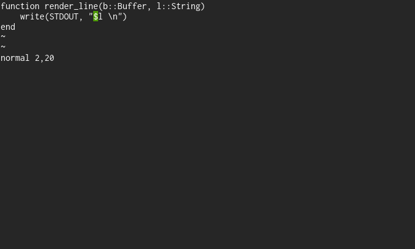

# Joy

[](https://travis-ci.org/lancebeet/Joy.jl)

[](https://coveralls.io/github/lancebeet/Joy.jl?branch=master)

[](http://codecov.io/github/lancebeet/Joy.jl?branch=master)

Joy is a modal line-based text editor written in Julia. This is a toy project; it is not a full-fledged text editor and parts of the foundation still need to be thought out. The goal of the project is a modal editor that is both implemented and extensible in Julia.

## How to install
```julia
julia> Pkg.clone("https://github.com/lancebeet/Joy.jl")
```

## How to use
To open existing text file:
```julia
julia> using Joy
julia> buffer = Joy.open("textfile")
```
To exit:
```julia
:quit()
```
To save:
```julia
:save("filename")
```
Reattaching to an existing buffer from the REPL:
```julia
julia> Joy.attach(buffer)
```

To edit files directly from the command line, add the following to your shell config file (.bashrc, .profile etc):
```bash
function joy() { julia -e "using Joy; Joy.open(\"$1\")"; }
```
Implemented features so far: Basic motions (stepping, word movements, find char, EOL, end/beginning of file), insert mode (with before/after/EOL init) deleting/yanking/pasting with custom registers and arbitrary motions, command mode (very primitive), macro record/recall to custom registers, constructors for custom regex word movement functions.

vi-like movement


Command mode for evaluation of Julia expressions


Applying arbitrary Julia maps to the entire buffer


Editing/sourcing of its own configuration



On-the-fly custom word types


